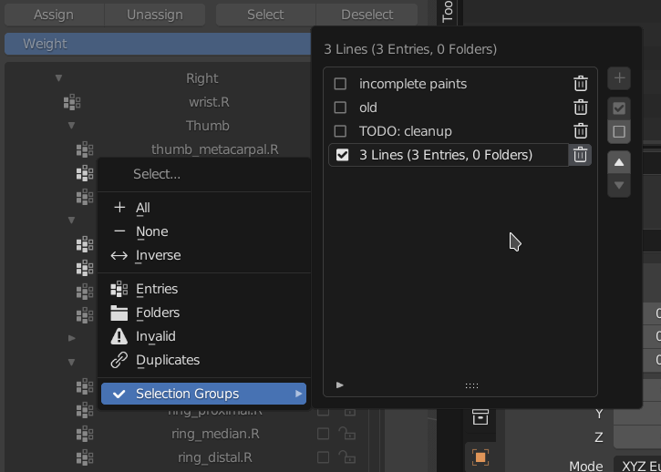

# Vertex Codex
###### Vertex Codex v1.0
###### Michael Glen Montague

A [Blender](https://www.blender.org/) add-on that provides copious amounts of compartmentalization for ***Vertex Groups*** in a special panel called the ***Vertex Codex***, which is accessed in the 3D View's sidebar and available to all Mesh-based Objects. Each *Page* of the codex can be thought of as a *Vertex Group Collection*, with its own context for *Folders*, *Selections*, *Selection Groups*, and visible Vertex Groups.

(screenshot taken in Blender 3.3 LTS)

| Feature          | Description                                                                                                                                                                                         |
|------------------|-----------------------------------------------------------------------------------------------------------------------------------------------------------------------------------------------------|
| Nondestructive   | Vertex Groups are displayed as "Entries", allowing them to be shown in many places at once and be freely moved, deleted, or copied without affecting the actual Vertex Groups list.                 |
| Folders          | Manage Entries with Folders, which can also contain other Folders.                                                                                                                                  |
| Merge / Copy     | A new Entry can be created with the mixed weights of all selected Entries. If only one Entry is selected, this effectively copies it.                                                               |
| Pages            | Each Page is a separate configuration of Entries and Folders. If a Page matches the original Vertex Groups list (1:1 with no duplicates), it can be used to sort the original list with one click.  |
| Multi-Selection  | Vertex Codex operations will apply to all selected "Lines" (Entries and Folders). This applies to vertex assignment and vertex selection, but **not** weight painting.                              |
| Selection Groups | Selections may be saved to the Page and used to reselect (or deselect) Lines at a later point.                                                                                                      |

___

## Definitions

- ### Blender Definitions

An ***Operator*** is a function in Blender that executes an action or enters an interactive *modal* to configure a pending action, such as the *Translate* *Operator*. *Operator* execution can typically be undone or redone. Every keyboard or mouse shortcut (or "keymap") in Blender's *Preferences* is associated with an *Operator*.

___

A ***Property*** is a piece of data in Blender such as a number (`IntProperty`, `FloatProperty`), a False-or-True condition (`BoolProperty`), an **enum**erated group of possible values (`EnumProperty`), a homogenous list of other *Properties* (`CollectionProperty`), a vector of up to 32 dimensions (`IntVectorProperty`, `FloatVectorProperty`, `BoolVectorProperty`), or a reference to another *Property* (`PointerProperty`) or to an instance of any of Blender's fundamental `ID` data-block types, such as `Object`, `Action`, `Brush`, `Lattice`, `Mesh`, `GreasePencil`, `ParticleSettings`, and `Material`.

___

A ***Menu*** is a vertical or radial group of *Operators*, *Properties* (rarely), and sub-menus.

___

A ***Panel*** is a visual interface that can typically be opened, closed, and rearranged. Examples include the ***Vertex Groups*** *Panel* and ***Shape Keys*** *Panel* in the *Properties* editor, and the ***Transform*** *Panel* in the *3D View* editor's sidebar. A *Panel* can also be opened as a popup in the same fashion as a *Menu*.

___

A ***Vertex Group*** is a data structure that ascribes a precise decimal number (from 0.0 to 1.0) to each of a *Mesh*'s vertices that it is in possession of. This is useful for associating a group of vertices to a *Bone* on an *Armature*, to give *Shape Keys* varied influence over a *Mesh*, or to compartmentalize a *Mesh* for whatever reason.

___

- ### Vertex Codex Definitions

The ***Vertex Codex*** is the *Panel* that holds all of this add-on's features.

___

A ***Page*** is a specific "collection" of *Vertex Groups*. The first *Page* created will be automatically filled with an *Entry* for each *Vertex Group*.

___

An ***Entry*** represents a single *Vertex Group*'s appearance on a *Page*; a *Vertex Group* can be associated with multiple *Entries* on any number of *Pages*.

___

A ***Folder*** encapsulates *Entries* and other *Folders*. It can be used to hide, move, or delete multiple *Entries* or *Folders* on a single *Page*.

___

*Entries* and *Folders* are collectively called ***Lines***.

___

***Activation*** is when a single *Line* is targeted by clicking on it. The *Active* *Line* is only used in operations when there are no *Selected* *Lines*.

___

***Selection*** differs from *Activation* in that multiple *Lines* can be *Selected* at once. A *Line* is quickly *Selected* by clicking the square on the right side of its name, but other methods exist to *Select* multiple *Lines* at once.

___

## Information

- ### Hidden Menus

Click-holding or click-dragging on some *Operators* will open a menu full of relevant operations. These menus are hidden from the main view to simplify the user interface. There are several places in *Vertex Codex* where such menus appear:

---

- #### Selection Box

A single click toggles the *Selection* state of one *Line*. The hidden menu allows you select, deselect, or invert the selections of all *Lines* on the *Page*. Additionally, you can select all *Entries*, *Folders*, invalid *Entries* (which are *Entries* that don't point to valid *Vertex Groups*,) or *Entries* that were duplicated while still pointing to the same *Vertex Group*.

At the very bottom of this menu is the **Selection Groups** panel.

A similar menu appears under the *Vertex Group* *Selection Boxes* in the "Add" popover *Panel*.

---

- #### Lock Weights Button

A single click toggles the relative weights locking status of an *Entry's* original *Vertex Group*. The hidden menu is similar to that of the *Selection Box*.

---

- #### Page Left/Right Buttons

A single click sends you to the left or right page. The hidden menu contains shortcuts for jumping to any page. This menu will only appear if there are three or more *Pages*.

A similar menu appears under the page left/right buttons of the "Copy" popover *Panel*.

